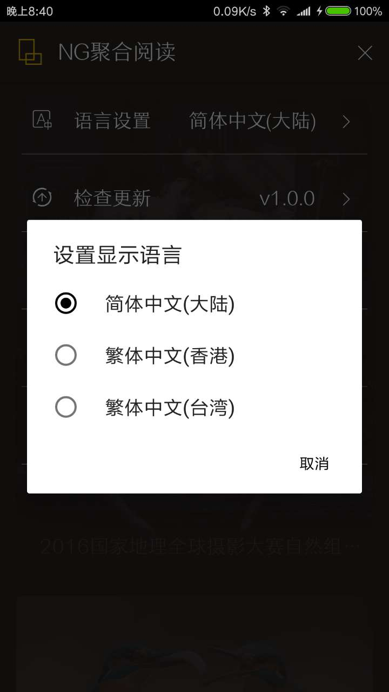

# 国家地理每日精选 第三方客户端
## 开发缘由
作为一个地理爱好者,感觉每日精选应用是在有点丑= =,于是花了些业余时间开发了这个应用,纯 Kotlin 源码,也是第一个练手的应用项目吧。

## 应用预览




## 项目特点
- 纯 Kotlin 开发
- Fresco
- Reactive 响应式编程
- Retrofit2
- MVP 架构
- ...

## 直接下载
你可以直接使用已经打包的程序直接使用,无任何毒副作用哟。

## 编译本项目
无特殊配置,已加入 `Bugly` 支持,感兴趣的可以通过 `build.gradle` 看下如何配置应用 ID
 
## License
 ```
 Copyright 2017 Boger Chan
 
 Licensed under the Apache License, Version 2.0 (the "License");
 you may not use this file except in compliance with the License.
 You may obtain a copy of the License at
 
    http://www.apache.org/licenses/LICENSE-2.0
 
 Unless required by applicable law or agreed to in writing, software
 distributed under the License is distributed on an "AS IS" BASIS,
 WITHOUT WARRANTIES OR CONDITIONS OF ANY KIND, either express or implied.
 See the License for the specific language governing permissions and
 limitations under the License.
 ```
